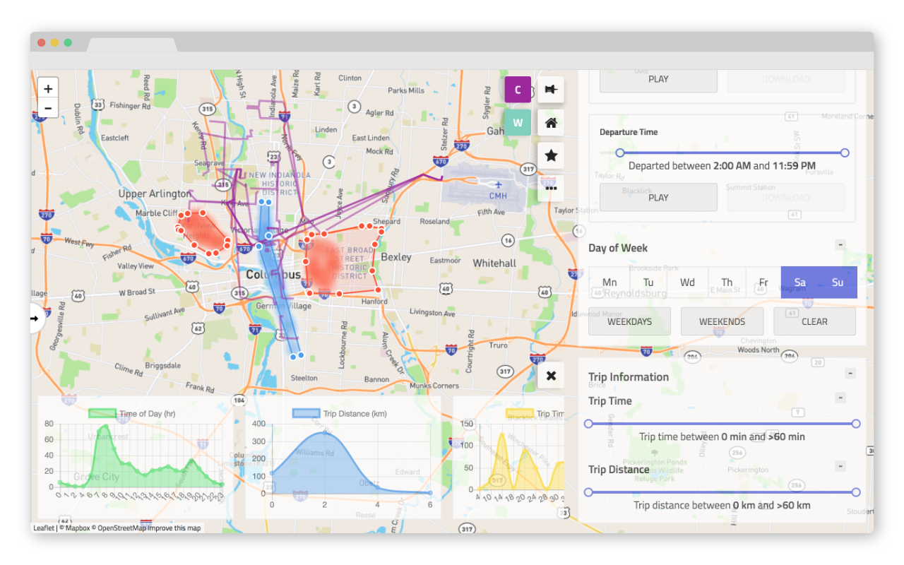

# Crossroads: Interactive Vehicle Fleet Data Analysis using Touch Screens

Dan Arters, Trey Hakanson, Arnab Nandi

 Crossroads is a self-serve interactive data analytics platform for vehicle trips, V2X and related spatiotemporal datasets. Existing platforms are either not tailored to the intricacies of spatiotemporal datasets, or are not able to display results real time. Due to the commercial and closed-source nature of many GIS tools, it is very hard to customize or extend them for domain-specific research & analysis. Crossroads is a self-serve open-source stack for exploring spatiotemporal datasets using direct manipulation. Crossroads allows users to intuitively construct complex queries, and display the results real time, gives analysts an easy path to drawing insights from any spatio-temporal dataset. 



A Node + React application to query spatiotemporal data using an interactive and intuitive query paned. The application features full ES6 stage-1 capabilities on the API and frontend. The frontend is compiled using Webpack and the backend is built using the babel-cli (babel-node) and Nodemon in development, and PM2 in production.

Note that this project utilizes the [yarn](https://yarnpkg.com/en/) package manager, but `npm` will also suffice.

configurations have been purposely omitted from this repository for security reason, so you will need to create your own before running the application.

the core of the project (api, frontend) is found in the `node` folder

---

## Project Setup

### Install Dependencies

First, start by installing the required node dependencies:

```sh
yarn install
```

### Database Configuration

The project requires a PostgreSQL instance in order to run. You can connect to a local or remote source, and will need to add a `config/db-config.json` file to specify a few parameters:

```js
{
  "user": "<user_name>",
  "database": "<db_name>",
  "password": "<password>",
  "host": "<host>",
  "port": 5432,
  "max": 10,
  "idleTimeoutMillis": 30000
}
```

where `"max"` is the maximum number of clients in the worker pool.

PostGIS is a required extension for the Postgres database. This extension can be installed [here](https://postgis.net/install/). The extension will automatically be added to the database by the database setup utility script below.

The database can be initialized using the SQL files found in the `db/migration` folder. There is a utility script that can be run from any user with postgres permissions to setup the database automatically (run from the project's root):

```sh
bash ./db/setup_db.sh <username> <db_name>
```

Where `<username>` and `<db_name>` match the values in `config/db-config.json`. If you run into any issues, ensure that you have the correct permissions to perform the required actions.

This will create the required tables, upload the sample data from `db/data/yellow_tripsdata.csv`, and perform other required migrations. The sample data is [TLC trip data](http://www.nyc.gov/html/tlc/html/about/trip_record_data.shtml) from the city of New York between the dates 2015-12-31 and 2016-06-30.

Keep in mind that when a new, custom set of placemarks is added, the `trips` table and `query_view` materialized view will need to be regenerated. This can be done with the `db/migration/build_trips_table.sql` and `db/migration/create_query_view.sql` utility scripts. See the script for more information about its functions and how to properly utilize it.

### Map Configuration

In order to view maps, you need to create a `config/map-config.json` file. We utilized [Mapbox](https://www.mapbox.com/) for tilesets while building this project, but any tileset provider will do. This file contains parameters such as access tokens needed to call an API for tiles, and should look similar to the following:

```json
{
   "view_lat": "40.724735",
   "view_lng": "-73.924442",
   "projectId": "<project_id>",
   "accessToken": "<access_token>",
   "attribution":
      "Map data &copy; <a href=\"http://openstreetmap.org\">OpenStreetMap</a> contributors, <a href=\"http://creativecommons.org/licenses/by-sa/2.0/\">CC-BY-SA</a>, Imagery © <a href=\"http://mapbox.com\">Mapbox</a>",
   "tileTemplateUrl":
      "https://api.mapbox.com/styles/v1/mapbox/dark-v9/tiles/256/{z}/{x}/{y}"
}
```

`view_lat` and `view_lng` will determine were the map will be centered initially. The values given here are for New York City, since this is where the provided sample data is located.

If you haven't yet created a tileset, you can use `mapbox.satellite` as the `projectId` to make sure the rest of your configuration is working. Leaflet supports tilesets other than Mapbox as well, so the `tileBaseUrl` (and in turn the `attribution`) can be changed as desired.

### Additional Configuration

Query configuration is required to tune the execution of the queries. Our recommended values are as follows, and are provided in `config/query-config.json`:

```json
{
   "distributionGraphConfig": {
      "tripTimeIntervals": 10,
      "tripDistanceIntervals": 1,
      "minimumPrevelanceCutoff": 0.01
   },
   "tripInformationSliderConfig": {
      "maxDistance": 60,
      "maxTime": 60
   }
}
```

### Start the Application

Once the above setup has been completed, to run the application perform the following:

```sh
# start the node server
yarn start

# build the react application (in separate window)
yarn run serve-app
```

both the server and react application will watch for changes an rebuild accordingly, and both will output errors if any.

## Production Builds

To build the production versions of the client and server, use:

```sh
# Builds the client
yarn run build-app

# Builds the server
yarn run build-prod
```

To run the production server (which will serve the production application), run the following as a user with root access (it is highly NOT recommended to use the actually root user, for security reasons):

```sh
yarn run start-prod
```

If you have a staging environment, you may choose to run the production server in staging mode (has some debugging configuration):

```sh
yarn run start-pm2-dev
```

## Acknowledgements

Authors of this project were supported by the National Science Foundation under awards IIS-1422977, IIS-1527779, and CAREER IIS-1453582; and The Office of Undergraduate Research and Creative Inquiry at The Ohio State University through a Summer Scholarship.

Dependency licenses were considered when open sourcing this project. No dependency features licenses that would cause copyright issues down the line. If you wish to see the specific license issue for all dependencies and peer dependencies in this repository, utilize [license-checker](https://github.com/davglass/license-checker).

[](https://github.com/prettier/prettier)
